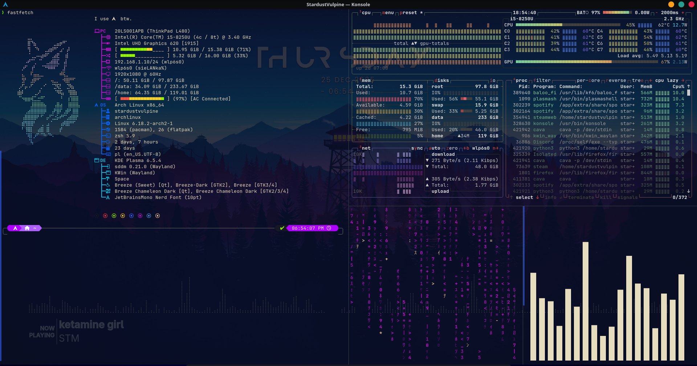
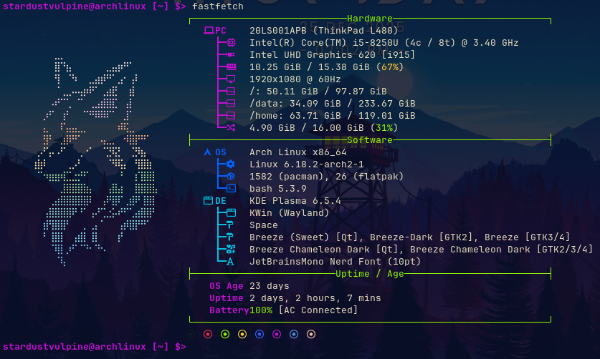

# My-ArchLinux-Configs

This is my repo to hold and backup all my Arch Linux setup config files for easy reusability across my devices :) 



Tools used on this screenshot: fastfetch, btop, unimatrix, cava

## Table of contents
- [How to setup](#how-to-setup)
  - [Fastfetch](#fastfetch)
    - [Requrements](#packages-requrements)
    - [Setup](#setup)   

## How to setup

### Fastfetch

#### Packages Requrements:
- `fastfetch`
- `ttf-jetbrains-mono-nerd`

#### Setup:
1. Install requred packages:
For Arch-based system run:
```
sudo pacman -S fastfetch ttf-jetbrains-mono-nerd
```
For other distros use your distro package manager.

2. Download `./fastfetch` folder or `git clone` this repo.

3. Go to `~/.config/fastfetch` folder in your home directory and put there files:
- `ascii.txt`
- `config.jsonc`
  
4. Done. Enjoy my fastfetch config. You can edit it however you want :)
