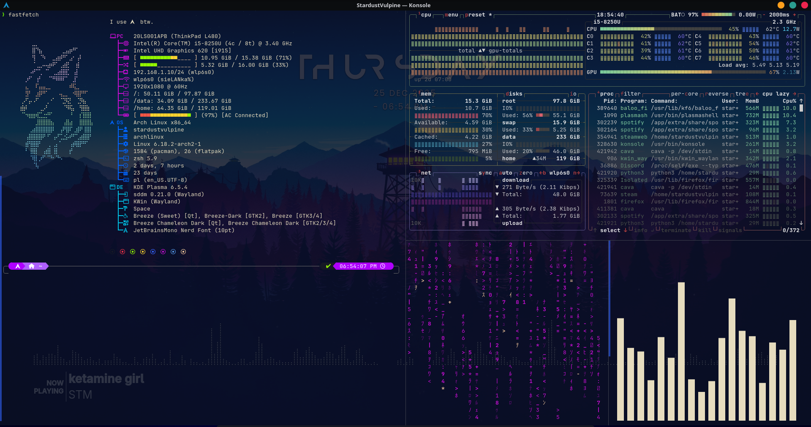
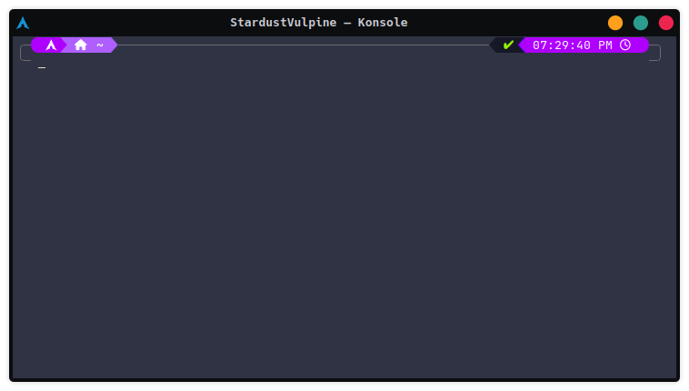
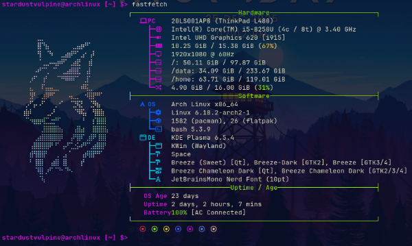

# My-ArchLinux-Configs

This is my repo to hold and backup all my Arch Linux setup config files for easy reusability across my devices :) 



Tools used on this screenshot: fastfetch, btop, unimatrix, cava

## General Information
- I use `yay` pacman wrapper for installing AUR packages easly
- I use KDE Plasma 6.5.4+ on Wayland
- 

## Setup Instructions
- [Konsole](#konsole)
- [Fastfetch](#fastfetch)
- [Zsh](#zsh) 

## Konsole
My profile for KDE Konsole terminal emulator.



### Setup:
Simply download my profile file from `./konsole/StardustVulpine.profile` in this repo.

Put profile file in `~/.local/share/konsole/`

If you want my Konsole settings regarding menus, bars, spliters, download `./konsole/konsolerc` file and put it in `~/.config` directory.


## fastfetch

#### Packages Requrements:
- `fastfetch`
- `ttf-jetbrains-mono-nerd`

### Setup:
1. Install requred packages:
Arch:
```
sudo pacman -S fastfetch ttf-jetbrains-mono-nerd
```
For other distros use your distro package manager.

2. Download files from `./fastfetch` folder in this repo.

3. Go to `~/.config/fastfetch` folder in your home directory and put there files:
- `ascii.txt`
- `config.jsonc`
  
4. Done. Enjoy my fastfetch config. You can edit it however you want :)

## zsh
#### Packages Requirements:
- `zsh`
- `zsh-completions` *(optional for additional completions definitions)*
- `zsh-theme-powerlevel10k` *([from AUR](https://aur.archlinux.org/packages/zsh-theme-powerlevel10k))*
- `ttf-jetbrains-mono-nerd`

### Setup:
1. Install requirements:

- Packages:
```
sudo pacman -S zsh zsh-completions ttf-jetbrains-mono-nerd
```
- zsh theme from AUR:
```
yay -S zsh-theme-powerlevel10k
```

2. Enable zsh config:
Open `~/.zshrc` file:
```
nano ~/.zshrc
```
if file doesn't exists, it should create it.

Paste this at the top of `~/.zshrc` file:
```
source /usr/share/zsh-theme-powerlevel10k/powerlevel10k.zsh-theme
```
If path to zsh theme file is invalid, run:
```
pacman -Ql zsh-theme-powerlevel10k | grep powerlevel10k.zsh-theme
```
and find path to `powerlevel10k.zsh-theme`.

3. Switch to zsh.
Run:
```
zsh
```
Since `powerlevel10k` theme is already installed and included in `~/.zshrc`, configuration wizard should start right after switching to zsh shell.
If you want to configure it on your own, go through it. However if you want to use my configs, continue to next steps.

4. Apply my configuration files:
- Download files from `./zsh` folder in this repo.
- Paste `.zshrc` and `.p10k.zsh` to your home directory.
*(Downloaded files won't have dot at the beggining, you must add it in order to configs load properly)*

5. Restart terminal and run `zsh` to apply new configs.

6. Make zsh default shell:
Run:
```
chsh -s /usr/bin/zsh
```
Relog or reboot to apply this change.

> [!TIP]
> Usefull command to get colors and thier IDs for customization zsh theme:
> ```
> for i in {0..255}; do print -Pn "%K{$i}  %k%F{$i}$i%f " ; done
> ``` 


## 🛠️ Under Construction 🛠️
